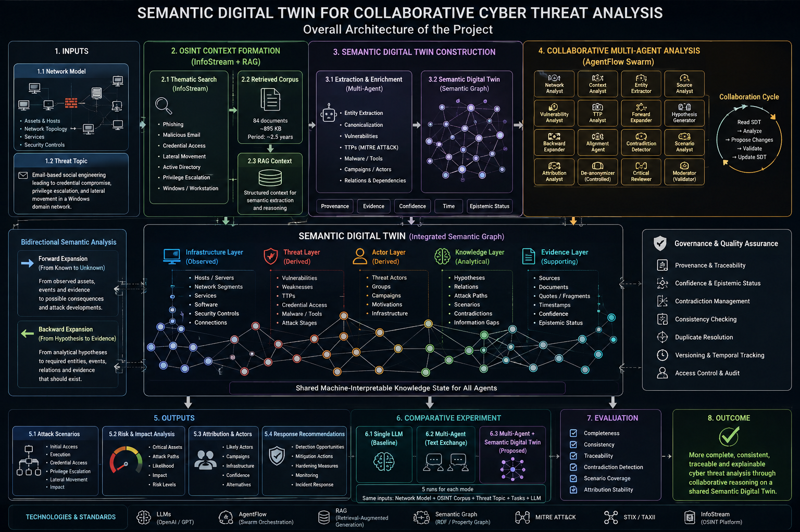

# semantic-digital-twin-collaborative-cyber-analysis
# Semantic Digital Twin for Collaborative Cyber Threat Analysis



**Figure 1. Overall architecture of collaborative cyber threat analysis based on a Semantic Digital Twin**

## Overview

This repository presents a research project on the use of a **Semantic Digital Twin (SDT) as a shared machine-interpretable knowledge environment for collaborative cyber threat analysis**.

The central idea is to move beyond conventional multi-agent architectures in which specialized AI agents primarily exchange textual messages. Instead, the agents collaboratively construct, validate, and refine a common semantic representation of the investigated cyber situation.

The Semantic Digital Twin integrates:

- the technical configuration of the investigated network;
- a dynamically formed OSINT context;
- vulnerabilities and threat mechanisms;
- tactics, techniques, and procedures (TTPs);
- malware, tools, campaigns, and threat actors;
- analytical hypotheses and contradictions;
- information gaps;
- attack, attribution, and response scenarios;
- evidence provenance and epistemic status.

The project focuses not on technical attack simulation, but on the **reconstruction and collaborative analysis of the semantic structure of a cyber incident**.

---

## Research Problem

Large Language Models (LLMs) and multi-agent AI systems provide powerful mechanisms for cyber threat analysis. However, conventional multi-agent implementations usually rely on natural-language messages as the primary means of communication between agents.

This creates several problems:

- intermediate findings may be lost during summarization;
- the same entities may receive different interpretations;
- semantic relations may be repeatedly reconstructed;
- evidence provenance may become detached from conclusions;
- contradictions may disappear during successive stages of reasoning;
- alternative hypotheses may be prematurely eliminated.

The proposed approach introduces the **Semantic Digital Twin as the shared analytical state of the multi-agent system**.

Each specialized agent:

1. reads the current state of the Semantic Digital Twin;
2. performs a specific analytical function;
3. proposes a structured modification;
4. provides supporting evidence and provenance;
5. submits the modification for validation.

A moderator validates these modifications before they become part of the shared model.

Therefore, collaboration takes place through a continuously evolving semantic network rather than through a sequence of textual summaries.

---

## Experimental Environment

The experiment uses a compact model of a corporate network containing:

- an external network segment;
- firewall and network protection components;
- a DMZ;
- a web server;
- an internal server segment;
- a domain controller;
- file and database servers;
- user workstations.

The investigated cybersecurity problem (`THREAT_TOPIC`) is defined as:

> **Email-based social engineering leading to credential compromise, privilege escalation, and lateral movement in a Windows domain network.**

The initial infrastructure model contains only the observable technical state of the network. It does not contain predefined attack paths or threat intelligence.

Threat-related semantic elements are introduced only when they are supported by the external information context or explicitly represented as analytical hypotheses.

---

## Dynamic OSINT Context

The external information context was formed using the **InfoStream information and analytical system**.

Instead of using a generic cybersecurity corpus, a narrow thematic retrieval request was constructed specifically for the investigated network and threat scenario:

```text
("phishing" | "spear phishing" | "malicious email" |
 "email attachment" | "fake IT support")
&
("credential theft" | "credential access" |
 "credential dumping" | "stolen credentials" |
 "account compromise")
AND
("lateral movement" | "domain controller" |
 "Active Directory" | "internal network" |
 "privilege escalation")
&
(Windows | workstation | Rendpoint)
