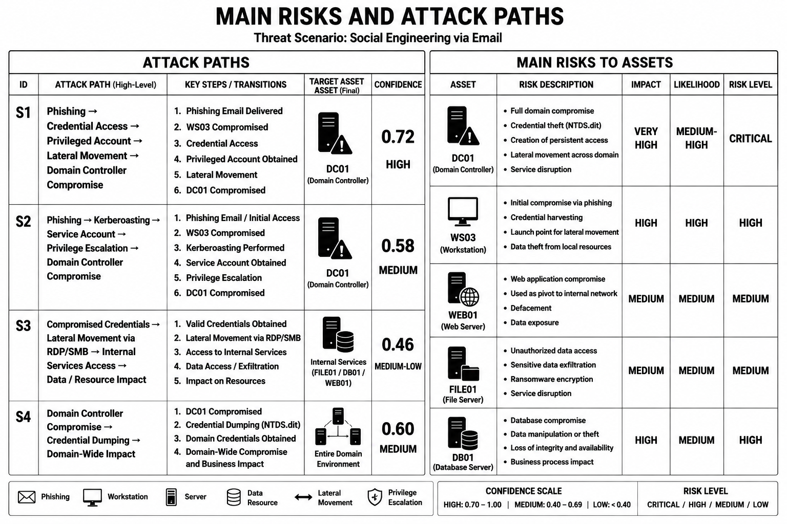

# Experimental Results

This directory presents the principal experimental results obtained during the
validation of the proposed collaborative cyber threat analysis methodology based
on a Semantic Digital Twin (SDT).

The experiment investigates a social-engineering attack scenario initiated by a
phishing email and potential compromise of a user workstation. The analysis
combines a compact corporate network model, an OSINT/RAG information context,
semantic graph construction, and multi-agent reasoning.

The experimental workflow can be summarized as:

**Base Network Model → Semantic Digital Twin → Attack Scenario Extraction → Risk Assessment**

---

## 1. Initial Corporate Network Model

The experiment starts from a compact reproducible corporate network derived from
the CICIDS2017 architecture.

The model contains an external attacker network, firewall, DMZ, server subnet,
domain controller, internal services, and user workstations.

The workstation **WS03** is defined as the potential initial compromise point for
the investigated social-engineering scenario.

.png)

*Initial corporate network model used as the technical state of the experiment.*

---

## 2. Semantic Digital Twin

The initial infrastructure model is enriched with information extracted from the
OSINT/RAG context and results produced by specialized analytical agents.

The resulting Semantic Digital Twin integrates:

- observed network assets and connections;
- inferred and virtual entities;
- credential-access mechanisms;
- privilege-related entities;
- lateral-movement relationships;
- relevant MITRE ATT&CK TTPs;
- alternative semantic paths;
- evidence-supported relationships;
- information gaps and analytical hypotheses.

Unlike the initial network topology, the resulting model represents not only
technical connectivity but also the current semantic state of knowledge about
the investigated cyber situation.

.png)

*Semantic Digital Twin obtained by contextual enrichment of the initial network model.*

---

## 3. Attack Scenarios

Attack scenarios are extracted from the structure of the Semantic Digital Twin
rather than generated as isolated textual narratives.

The experiment identifies several alternative attack paths connecting the
initial compromise of **WS03** with credential access, privilege escalation,
lateral movement, internal services, and the domain controller.

Each scenario contains:

- a high-level attack path;
- ordered attack steps;
- corresponding MITRE ATT&CK techniques;
- target assets;
- confidence assessment;
- evidence support.

.png)

*Attack scenarios derived from the Semantic Digital Twin.*

---

## 4. Main Risks and Attack Paths

The final analytical stage transforms the identified attack paths into an
asset-oriented risk representation.

The analysis highlights the assets that may become critical targets during the
development of the investigated attack and associates them with possible impact,
likelihood, and overall risk level.

The resulting representation provides a direct transition from semantic
reasoning about possible attack development to interpretable cyber-risk
assessment.

*Main risks to network assets and attack paths identified from the Semantic Digital Twin.*

---

## Experimental Interpretation

The results demonstrate the transition from a conventional network topology to a
context-enriched semantic representation of the cyber situation.

The Semantic Digital Twin connects observed infrastructure with external
information, inferred entities, attack techniques, credential-access mechanisms,
and possible transitions between system states. This makes it possible to derive
alternative attack scenarios while preserving their relationship with the
underlying network assets and supporting evidence.

The experiment therefore illustrates the complete analytical chain:

**observed infrastructure → contextual semantic enrichment → shared semantic
state → attack-path reconstruction → scenario assessment → cyber-risk
identification**

These results support the use of a Semantic Digital Twin as a shared
machine-interpretable knowledge state for collaborative cyber threat analysis by
specialized AI agents.
